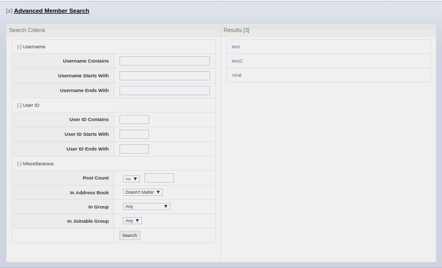

## Description

Adds a "Member Search" dropdown link to the top menu, allowing you to perform a much more advanced search on members than is possible in via the standard "Members" page. Clicking this brings up a form where you can perform a search on members by the following criteria:

* Username contains
* Username starts with
* Username ends with
* User ID contains
* User ID starts with
* User ID ends with
* Post count <, <=, =, >=, > x
* In address book (filters out users who are not in your address book, or vice versa)
* In group (only search through Admins, for example)
* In joinable group (search through users in specific joinable groups)

**Note**: In FireFox, and some other browsers it will give you a loading process screen, from 0% - 100% when first opening the search form. In other browsers, such as Google Chrome, this does not happen and it seems as if the page has frozen. Don't panic! It's just how the browser handles it. Why? This uses synchronous AJAX (not the usual asynchronous) and this process will take longer depending on how many members you have. For the preview forum, there are around 1,200 members and the process takes roughly 10 seconds. Once it has loaded once, there is no more loading and you can use the search form as many times as you desire. Do note that since this uses AJAX, it will eat up ad credits, so if you have purchased ad removal, I would not recommend this modification.

**Original Release Date**: November 23, 2010

## Preview

**Topmenu Link**

**Member Search Form**

## Installation Instructions

`main.js`: Admin CP **>>** Themes **>>** Board Templates **>>** Below the Board
