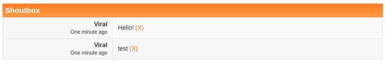
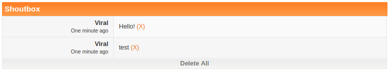
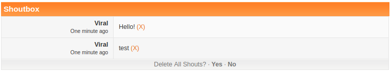

## Description

There is no easy way to delete all shoutbox messages without manually going through each and clicking `(x)`. This code gives the ability to prune all messages at the click of a button, to help with wiping spam bots, or simply starting-over. This option is restricted to those who have access to the Report CP (moderators and admins). To prevent accidentally deleting all messages, there is a confirmation message before anything happens.

**Original Release Date**: December 21, 2010

## Preview

**Original Shout Archive Page**

**With the Delete All Button**

**Confirmation of Delete All**

**All Shouts Deleted**

## Installation Instructions

`main.js`: Admin CP **>>** Themes **>>** Board Templates **>>** Below the Board
