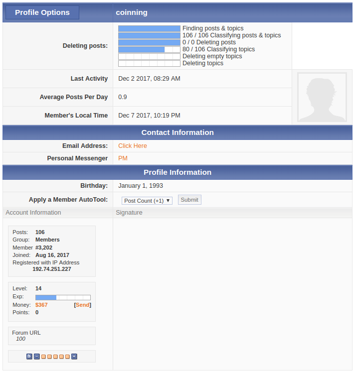

## Description

This adds the option for all admins to edit/ delete all topics and posts by any user. This can be used to mass delete a user's posts if they have requested it, or more commonly to prune all posts and topics by a spambot by a few clicks of a button. You are given the option to differentiate between topics with replies, and topics without replies. This allows you to 'save' topics which have replies from other users as deleting a topic would normally delete those replies as well. To make use of this feature, navigate to a user's profile and hover over the "Profile Options" dropdown. A new option "Edit/ Delete Posts" will appear - click this and follow the instructions.

This is an incredibly powerful tool and should be treated with caution; note this option is only activated for admins and no one else. This was originally a premium modification, and is now being offered for free in my "everything should be open-source" movement :) .

**Ad-credit Friendly**: This code has been modified so as to not use up any ad-credits.

**Original Release Date**: August 19, 2014

## Preview

**During the Pruning**

**Pruning Complete**

**User has no topics (all deleted)!**

**Video**

The video below gives a more detailed overview of how to use the modification if necessary. If in doubt, use it on a test forum before employing it on your own board.

http://www.screencast.com/t/lFfZqHBW12YZ

## Installation Instructions

`main.js`: Admin CP **>>** Themes **>>** Board Templates **>>** Below the Board
