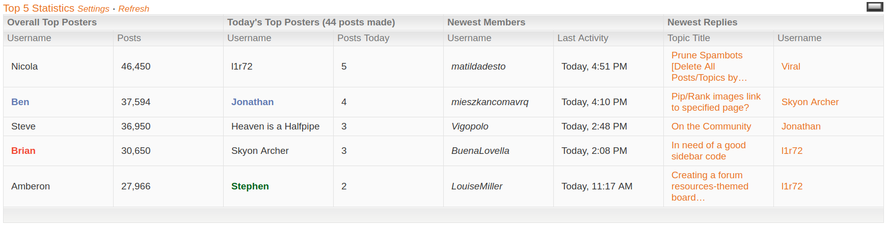
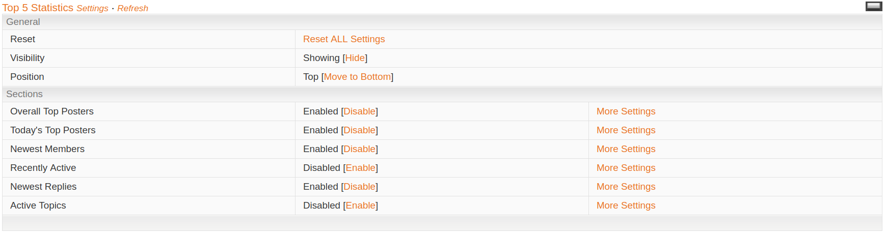
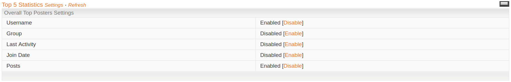

## Description

Adds a table to the forum which shows various different statistics and board feeds (aka modules, or sections). The modules available are:

* Overall Top Posters
  * Username
  * Group
  * Last Activity
  * Join Date
  * Posts
* Today's Top Posters
  * Username
  * Join Date
  * Posts Made Today
  * Percentage of Posts Made Today
* Newest Members
  * Username
  * Group
  * Last Activity
  * Join Date
  * Posts
* Most Recently Active Members (a.k.a last online)
  * Username
  * Group
  * Last Activity
  * Join Date
  * Posts
* Newest Replies
  * Topic Title
  * Username
  * Number of Replies
* Active Topics
  * Topic Title
  * Topic Starter
  * Forum
  * Number of Replies
  * Number of Views
  * Topic Info (last post date, and member who posted)

Admins can disable any of the sections (and sub-sections), or just set them so they don't show by default.  In the table, there is a settings panel where members can then configure the settings for themselves. For example, if an admin turned "Active Topics" off by default, a member can go to the panel and turn it on, and then set it so under this section it shows "Topic Title" and "Topic Starter". Your settings can be configured separately across different devices, so on your small-screen smartphone you could enable only one section instead of three, for example. There is a "reset all" link in the settings panel which will reset all settings to whatever the Admin has set as default.

There is a refresh button which refreshes all sections (and shows some loading text during the process). Alternatively, you can just click the section name to refresh just one section instead of them all (each section also has a loading symbol).

There is also a collapse/ expand button, similar to what forums have. Members can collapse the table if they do not want to see the statistics and expand it again at a later date if they wish. Again, this is device specific - so you can collapse the table on smart phones, and expand it on your laptop (for example). Admins set the table to either expand or collapse by default.

Finally, you can also move the table from the top of the page to the bottom of the page, and vice versa. Admins can choose where the table appears by default.

As you can see, Admins have a lot of control over the default settings of the table - its position, whether its collapsed/ expanded, which modules to show and hide (or even disable). Admins can also change the titles of all sections (and their sub-sections), the loading text, refresh text, title and even how many rows should be shown. For example, you could set the title to "Top 10 Statistics" and tell the table to show 10 rows of data instead of 5.

[b]Information: [/b]This is the only working "Top 'x' Statistics" code available for ZetaBoards now after a recent update caused all similar codes to stop working. The code has also been set up to add extra modules for different statistics and feeds. This option is there for developers to maximise the usefulness of this modification.

**Ad-credits**: This code consumes ad-credits and should be avoided on forums which have purchased ad-removal. Hopefully this can be fixed in the future (simply adding `force_ads` as a parameter to the AJAX requests is sufficient, but I have no time to test). Feel free to fork and make the changes yourself if you can.

**Original Release Date**: September 22, 2014

## Preview

**Statistics Table in all its Glory**

**Settings Configuration**

**Additional Settings (specifically for the 'Overall Top Posters' settings)**

## Installation Instructions

`main.js`: Admin CP **>>** Themes **>>** Board Templates **>>** Below the Board

Much of the code is modifiable to configure the global settings of the statistics feed. This includes which 'modules' to show by default, the position, whether its collapsed by default, the number of rows to show, etc etc. This is clearly marked in the top of the code (`main.js`) and follows the text in the description above. If you have difficulties, feel free to open an issue and I will help as quickly as possible.
